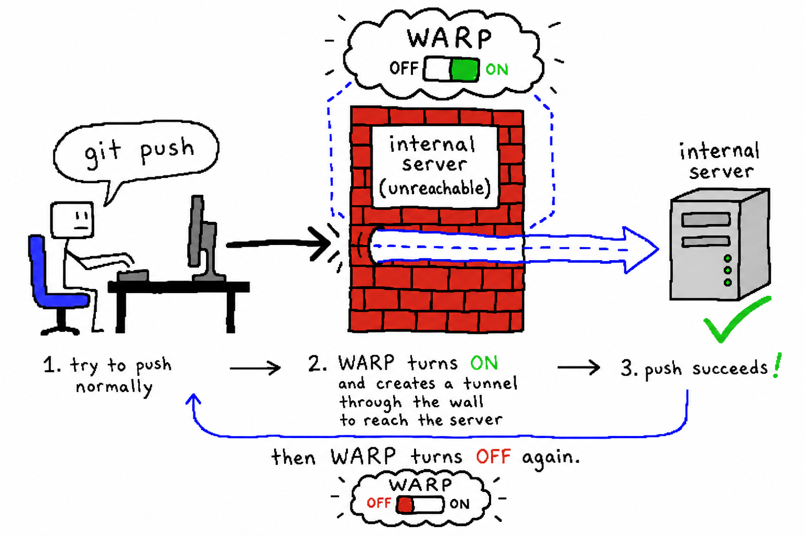

# git-warp

让只能通过 Cloudflare WARP 访问的内网 git 远端，照常用 `git push` / `git pull` / `git clone` 就能用——远端不通时自动开 WARP 穿墙，跑完再自动恢复 WARP 原状。可达的远端（如 github.com）完全不受影响。



> 正常 push → 撞上内网服务器墙 → WARP 自动 ON 打隧道穿墙 → push 成功 → WARP 自动 OFF 恢复原状。

English version: [README.en.md](README.en.md)

## 安装（一条命令搞定）

```sh
curl -fsSL https://raw.githubusercontent.com/pw-OpenCapsule/git-warp/main/install.sh | sh
```

跑完即装好并**自动激活透明模式**——脚本会把 `source <plugin>` 写进你的 shell rc
（`~/.zshrc` / `~/.bashrc` / `~/.profile`，按 `$SHELL` 自动判断，幂等不重复写）。
**重启终端**（或按提示 `source` 一下）后，照常 `git push` 就会在内网远端不通时自动走 WARP。

> 不想让脚本动你的 rc？加 `--no-activate`（或设 `GIT_WARP_NO_ACTIVATE=1`），见下方[备选](#备选不想改-shell手动激活)。

### 给 AI agent 用的 skill 安装

```sh
npx skills add pw-OpenCapsule/git-warp -y -g
```

这条只把 git-warp 作为 agent skill（Claude Code / Cursor / Codex / Gemini CLI）装好，
**不会改你的 shell、也不激活透明模式**——仅供 agent runner 显式调用 `git-warp` / `warp-run`。

## 用法（透明模式，已自动激活）

上面的一条命令已经帮你激活了透明模式，重启终端后照常用 git 即可，内网远端会自动走 WARP：

```sh
git push
git pull
git fetch --all
git clone https://your-internal-host/group/repo.git
```

只拦截网络子命令（`push` / `pull` / `fetch` / `clone` / `ls-remote` / `remote update`），其余子命令（`commit` / `status` / `add` / `log` …）原样直通真实 git，零延迟、零行为变化。

### 备选：不想改 shell / 手动激活

装的时候带 `--no-activate`（或 `GIT_WARP_NO_ACTIVATE=1`）就不会动你的 rc：

```sh
curl -fsSL https://raw.githubusercontent.com/pw-OpenCapsule/git-warp/main/install.sh | sh -s -- --no-activate
```

之后想自己控制时，把这行加到 `~/.zshrc` 或 `~/.bashrc`（脚本会打印这行）：

```sh
source ~/.local/bin/git-warp.plugin.sh
```

或者干脆不改 shell，直接调 `git-warp`，参数和 `git` 完全一样：

```sh
git-warp push origin main
git-warp clone https://your-internal-host/group/repo.git
```

### 批量脚本：只连接一次 WARP

如果一个脚本会循环执行很多次 `git-warp fetch`（例如同步上百个仓库），用
`git-warp batch` 包住整个脚本。它会在进入时按需连接一次 WARP，脚本结束后再恢复
WARP 原状；脚本内部的 `git-warp` 调用会看到目标 host 已可达，因此不会每次
connect/disconnect。

```sh
git-warp batch --host sg-git.pwtk.cc -- ./scripts/update_repos.sh
```

也可以用环境变量指定 host：

```sh
GIT_WARP_HOST=sg-git.pwtk.cc git-warp batch -- ./scripts/update_repos.sh
```

## 其它命令（不只是 git）

除了 git，别的要连内网的命令（创建 PR、调内网 API…）也能用同一套 WARP 逻辑——用 `warp-run` 包一下：目标 host 不通时自动开 WARP，跑完恢复原状。

```sh
# 创建 PR
warp-run tea pr create --base main --head feature ...
warp-run glab mr create ...

# 调内网 API
warp-run curl https://your-internal-host/api/...
```

`warp-run` 没有默认 host，需要设 `WARP_HOST`（或复用 `GIT_WARP_HOST`）：

```sh
export WARP_HOST=your-internal-host
```

### 自动化：让这些命令也像 git 一样自动走 WARP

把常用命令名加进 `WARP_WRAP_CMDS`（空格分隔），加到 `~/.zshrc` 或 `~/.bashrc`：

```sh
export WARP_HOST=your-internal-host
export WARP_WRAP_CMDS="tea glab"
source ~/.local/bin/git-warp.plugin.sh
```

之后照常敲 `tea pr create ...` / `glab mr create ...` 就自动走 WARP，不用每次记着加 `warp-run`。默认 `WARP_WRAP_CMDS` 为空，不强加任何命令，由你显式配置。

## 配置

| 环境变量 | 默认值 | 含义 |
|---|---|---|
| `GIT_WARP_HOST` | `clone` 取 URL 的 host；`push`/`pull`/`fetch`/`ls-remote` 取命令里 **remote 参数**的 host（按前导 `-C` 选中的仓库查），否则取 `origin` 远端的 host | git-warp 探测 / 走 WARP 的目标主机 |
| `GIT_WARP_PORT` | `443` | 探测可达性的端口 |
| `GIT_WARP_WAIT` | `40` | 等 WARP 把主机变可达的秒数 |
| `GIT_WARP_DEBUG` | 未设 | 设了（如 `1`）只打印解析出的 子命令/remote/host 然后退出，**不碰** WARP 和 git，用于排查 host 推断 |
| `git-warp batch --host <host> -- <cmd>` | 无 | 批量模式：为整个命令保持一次 WARP 连接，适合多仓库同步脚本 |
| `WARP_HOST` | 无（未设则回落 `GIT_WARP_HOST`） | warp-run 的目标主机；都没设 warp-run 报错退出 |
| `WARP_PORT` | `443`（回落 `GIT_WARP_PORT`） | warp-run 探测端口 |
| `WARP_WAIT` | `40`（回落 `GIT_WARP_WAIT`） | warp-run 等 WARP 的秒数 |
| `WARP_WRAP_CMDS` | 空 | 透明包装的额外命令名（空格分隔，如 `"tea glab"`），走 `warp-run` |

### host 解析顺序

`GIT_WARP_HOST` 最高优先；`clone` 从命令行 URL 取 host；`push`/`pull`/`fetch`/`ls-remote` 取命令里的 **remote 参数**（如 `fetch gitlab dev` → `gitlab` 远端），并在前导 `git -C <path>` 选中的那个仓库里查；没有位置 remote（`fetch --all`、`remote update`）或 remote 不存在时回退 `origin`。前导 git 全局选项（可重复的 `-C <path>`、`-c <kv>`、`--git-dir`、`--work-tree` …）按 git 自身的规则解析，所以把 `git-warp` 直接套在 `git -C /path -c … fetch <remote>` 前面也能从正确的仓库和 remote 解析出 host。

## 说明

- 远端已可达 → 完全不碰 WARP。
- 用 `trap` 恢复 WARP：进入时是关的就关回去，是开的就保持开；即使 git 失败或 Ctrl-C 也会恢复。
- 绝不断开不是自己开的 WARP 会话。

## 依赖

[`warp-cli`](https://developers.cloudflare.com/warp-client/get-started/)、`nc`（netcat）、`git`。

## License

MIT
